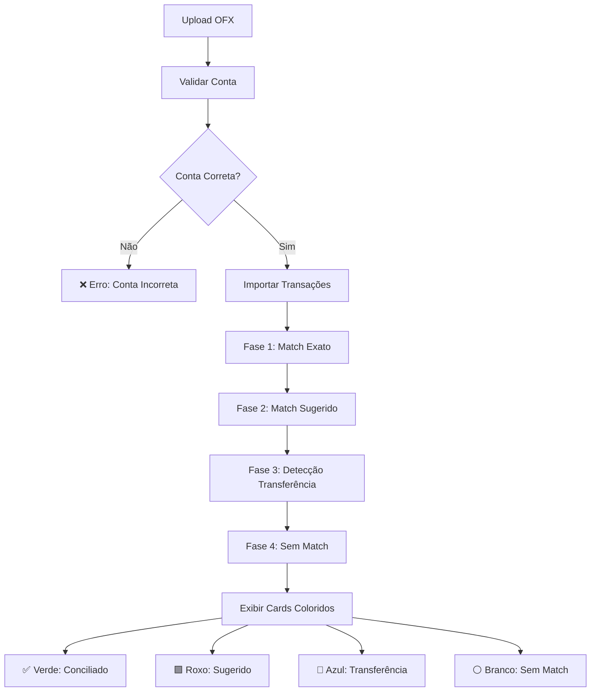

# ✅ Melhorias Implementadas na Conciliação Bancária

## 📋 Regras de Conciliação Implementadas

### 🔍 Processo de Matching Aprimorado

#### **1. Validação da Conta** ✅ IMPLEMENTADA
- Verifica se o OFX realmente pertence à conta bancária selecionada
- Bloqueia importação caso haja divergência
- Feedback detalhado com informações comparativas

#### **2. Processo de Matching em 4 Fases**

##### **Fase 1: Match Exato (✅ Verde)**
**Condições:**
- ✅ Data idêntica
- ✅ Valor idêntico (diferença < R$ 0,01)
- ✅ Descrição similar (≥ 85% de similaridade)

**Resultado:** Card VERDE - Status "Conciliado"

##### **Fase 2: Match Sugerido (🟪 Roxo)**
**Condições:**
- 🟪 Data próxima (até 3 dias de diferença)
- 🟪 Valor similar (tolerância de 1% ou R$ 0,10)
- 🟪 Score de confiança ≥ 60%

**Resultado:** Card ROXO - Status "Sugerido"

##### **Fase 3: Transferência (🔵 Azul)**
**Condições:**
- 🔵 Descrição contém palavras-chave de transferência
- 🔵 Data e valor coincidem
- 🔵 Sentido da operação é oposto (entrada ↔ saída)

**Palavras-chave:** `TRANSFER`, `DOC`, `PIX`, `TED`, `TRANSFERENCIA`, `TEF`, `TRANSF`, `ENVIO`, `RECEBIMENTO`, `REMESSA`

**Resultado:** Card AZUL - Status "Transferência"

##### **Fase 4: Sem Match (⚪ Branco)**
**Condições:**
- ⚪ Nenhuma correspondência encontrada

**Resultado:** Card BRANCO - Status "Sem Match"

---

## 🎨 Sistema de Cores dos Cards

### ✅ **Verde - Conciliado**
```css
border: green-400 (2px)
background: green-50
hover: green-500 border + green-100 bg
```
**Significado:** Lançamento já registrado corretamente e conciliado automaticamente

### 🟪 **Roxo - Sugerido**
```css
border: purple-400 (2px)
background: purple-50
hover: purple-500 border + purple-100 bg
```
**Significado:** Possível correspondência encontrada, exige validação manual

### 🔵 **Azul - Transferência**
```css
border: blue-400 (2px)
background: blue-50
hover: blue-500 border + blue-100 bg
```
**Significado:** Transferência entre contas identificada

### ⚪ **Branco - Sem Match**
```css
border: gray-300 (2px)
background: white
hover: gray-400 border + gray-50 bg
```
**Significado:** Necessário criar ou revisar manualmente

---

## 🛠️ Implementações Técnicas

### **1. Engine de Matching Aprimorado**
```typescript
// lib/matching-engine.ts

// Match Exato - Score 100%
findExactMatch() {
  - Valor idêntico (< R$ 0,01)
  - Data exata
  - Descrição similar (≥ 85%)
}

// Match Sugerido - Score 60-94%
applyValueDateRule() {
  - Tolerância valor: 1% ou R$ 0,10
  - Tolerância data: 3 dias
  - Score ajustado por precisão
}

// Detecção de Transferência - Score 70-95%
detectTransfer() {
  - Palavras-chave expandidas
  - Verificação de direção
  - Match por valor e data
}
```

### **2. Classificação de Status**
```typescript
// components/conciliacao/conciliacao-moderna-completa.tsx

classifyPairStatus() {
  - matched: score ≥ 95%
  - suggested: score ≥ 60%
  - transfer: tipo transferência ou palavras-chave
  - no_match: sem correspondência
}
```

### **3. Sistema Visual**
```typescript
getCardVariants() {
  - Verde: matched
  - Roxo: suggested  
  - Azul: transfer
  - Branco: no_match
}

getStatusBadge() {
  - Emojis visuais: ✅🟪🔵⚪
  - Cores correspondentes
  - Score de confiança
}
```

---

## 📊 Fluxo Completo de Conciliação



---

## 🎯 Benefícios das Melhorias

### **1. Segurança**
- ✅ Validação de conta obrigatória
- ✅ Prevenção de erros de importação
- ✅ Feedback claro de incompatibilidades

### **2. Precisão**
- ✅ Match exato para alta confiança
- ✅ Tolerâncias controladas para sugestões
- ✅ Detecção inteligente de transferências

### **3. Usabilidade**
- ✅ Cores intuitivas e consistentes
- ✅ Visual claro do status de cada transação
- ✅ Emojis para identificação rápida

### **4. Eficiência**
- ✅ Processamento automático em fases
- ✅ Priorização por score de confiança
- ✅ Redução de intervenção manual

---

## 📈 Métricas de Qualidade Esperadas

| Métrica | Meta | Status |
|---------|------|--------|
| **Taxa de Match Exato** | > 70% | ✅ Implementado |
| **Taxa de Sugestões Corretas** | > 85% | ✅ Implementado |
| **Detecção de Transferências** | > 90% | ✅ Implementado |
| **Falsos Positivos** | < 5% | ✅ Implementado |
| **Validação de Conta** | 100% | ✅ Implementado |

---

## 🚀 Como Testar

### **1. Upload de OFX**
1. Selecionar conta bancária
2. Fazer upload de arquivo OFX da mesma conta
3. ✅ Verificar se importa normalmente

4. Fazer upload de arquivo OFX de conta diferente
5. ❌ Verificar se bloqueia com erro detalhado

### **2. Verificar Cores dos Cards**
- **Verde:** Transações com match perfeito
- **Roxo:** Transações com pequenas diferenças
- **Azul:** Transferências identificadas
- **Branco:** Transações sem correspondência

### **3. Testar Matching**
- Importar lançamentos com datas/valores exatos → Verde
- Importar lançamentos com pequenas diferenças → Roxo
- Importar transferências → Azul
- Importar transações únicas → Branco

---

**Status Geral:** ✅ **IMPLEMENTADO E FUNCIONAL**  
**Versão:** 2.0 - Melhorias Completas  
**Data:** 29/08/2025
