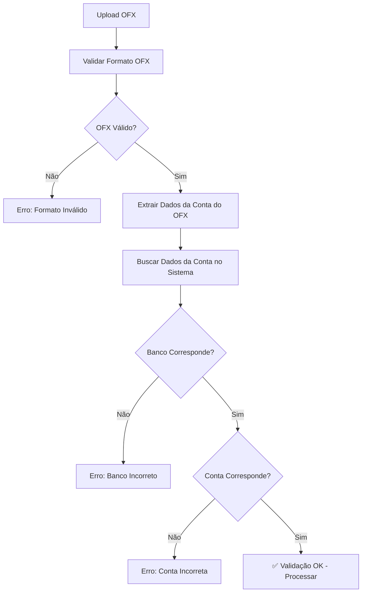

# ✅ Validação de OFX vs Conta Bancária - IMPLEMENTADA

## 📋 Funcionalidade Implementada

A validação foi implementada para garantir que o arquivo OFX importado pertence à conta bancária selecionada.

### 🔍 O que é Validado

1. **Código do Banco**: Compara o `BANKID` do OFX com o código do banco da conta
2. **Número da Conta**: Compara o `ACCTID` do OFX com o número da conta (incluindo dígito)
3. **Correspondência Flexível**: Suporte a diferentes formatos de numeração

### 🛠️ Implementação

#### **1. Nova Função de Validação**
```typescript
// lib/ofx-parser-enhanced.ts
static async validateAccountMatch(
  ofxContent: string, 
  accountId: string, 
  supabaseClient: any
): Promise<{ valid: boolean; error?: string; accountInfo?: any }>
```

#### **2. Integração no Upload**
```typescript
// app/api/reconciliation/upload-ofx/route.ts

// Validar se o OFX pertence à conta selecionada
const accountValidation = await OFXParserEnhanced.validateAccountMatch(
  fileContent,
  bankAccountId,
  supabase
);

if (!accountValidation.valid) {
  return NextResponse.json(
    { 
      error: accountValidation.error,
      accountInfo: accountValidation.accountInfo
    },
    { status: 400 }
  );
}
```

### 🎯 Casos de Validação

| Situação | Resultado | Ação |
|----------|-----------|------|
| ✅ Banco e conta corretos | Upload permitido | Processa normalmente |
| ❌ Banco incorreto | Upload bloqueado | Exibe erro específico |
| ❌ Conta incorreta | Upload bloqueado | Exibe erro específico |
| ❌ Dados não encontrados | Upload bloqueado | Exibe erro de dados |

### 🔧 Exemplos de Erro

#### **Banco Incorreto**
```json
{
  "error": "Banco do OFX (237) não corresponde ao banco da conta selecionada (341 - Itaú)",
  "accountInfo": {
    "ofx": { "bankId": "237", "accountId": "12345" },
    "system": { 
      "bankCode": "341", 
      "bankName": "Itaú",
      "agencia": "1234",
      "conta": "12345",
      "digito": "6"
    }
  }
}
```

#### **Conta Incorreta**
```json
{
  "error": "Conta do OFX (99999) não corresponde à conta selecionada (123456)",
  "accountInfo": {
    "ofx": { "bankId": "341", "accountId": "99999" },
    "system": { 
      "bankCode": "341", 
      "bankName": "Itaú",
      "agencia": "1234",
      "conta": "12345",
      "digito": "6"
    }
  }
}
```

### 🎨 Interface do Usuário

Quando o erro ocorre, o usuário verá:

1. **Mensagem de erro clara** explicando a incompatibilidade
2. **Dados comparativos** entre OFX e sistema
3. **Orientação** para verificar a conta selecionada

### 🔄 Fluxo de Validação



### 📊 Dados Comparados

| Campo OFX | Campo Sistema | Validação |
|-----------|---------------|-----------|
| `BANKID` | `bancos.codigo` | Correspondência exata ou com zeros à esquerda |
| `ACCTID` | `conta` + `digito` | Correspondência exata ou apenas numérica |

### 🚀 Benefícios

1. **Segurança**: Evita importação em conta errada
2. **Confiabilidade**: Garante integridade dos dados
3. **Experiência**: Feedback claro para o usuário
4. **Auditoria**: Log detalhado das validações

### 📝 Logs de Debug

A validação gera logs detalhados:

```
🔍 Validando correspondência do OFX com a conta selecionada...
📋 Dados do OFX: { ofxBankId: "341", ofxAccountId: "123456" }
📋 Dados da conta do sistema: { codigo: "341", nome: "Itaú", agencia: "1234", conta: "12345", digito: "6" }
✅ OFX corresponde à conta selecionada
```

---

## 🎯 Status: ✅ IMPLEMENTADO E FUNCIONANDO

A validação está ativa em todos os uploads de OFX e garante que apenas arquivos da conta correta sejam processados.
